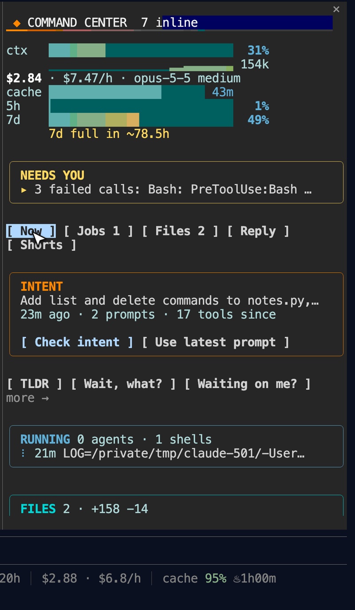

# command-center

A Claude Code mod that opens a pane beside the session and keeps the session's state in one place. It shows the intent (your first real prompt), the jobs that are running (subagents and background shells, each with a Stop button), the files touched with lines added and removed, the open questions from the last reply, Shorts (one-click prompts such as TLDR, Prove it, or Waiting on me?), and the pace of your 5-hour and 7-day usage limits. It also shows context use, session cost, and how long the prompt cache has left.

[](https://youtu.be/rY4fyCVfD5c)

Two-minute walkthrough, recorded from a real session: [youtu.be/rY4fyCVfD5c](https://youtu.be/rY4fyCVfD5c)



## The intent drift check

The first prompt of 30 characters or more becomes the session's intent. You can replace it with the latest prompt at any time.

After 15 prompts since the intent was set or last checked, or 150 tool calls since the intent was set with no check yet, the mod does two things on your next prompt:

- It shows a toast asking you to open the command center and press **Check intent**. That button sends a prompt asking what is done, what is not, and what drifted off the intent.
- It adds a note to the model's context for that prompt. The note restates the intent and asks the model to say in one line if the current request has moved away from it.

The thresholds are `DRIFT_PROMPTS` and `DRIFT_TOOLS` in `hooks/center.ts`.

## Install

```
/plugin marketplace add BioInfo/claudelicious
/plugin install command-center@claudelicious
/reload-plugins
```

The pane opens when a session starts. Run `/command-center` to open and focus it.

Requirements:

- A Claude Code build that supports mods (plugins with function hooks, loaded through `hooks/hooks.json` `modules`).
- A wide terminal. The engine decides where to seat the pane; a side pane needs about 144 columns or more. The mod asks for a 50-column pane, and a width you drag wins.

## What it reads and writes

Read this before you install any mod. It runs inside your Claude Code session.

It reads:

- Session events from Claude Code: your prompts, tool calls (tool name and input, for example the path and text of an Edit or the command of a background Bash), tool results (error text), turn steps and completions (model, effort, token usage, the final reply text), task notifications, and session measurements (context tokens, cost, rate-limit percentages and reset times).
- The list of running subagents, every 15 seconds.
- Your settings, once at session start, for `autoCompactWindow`.
- The `HOME` environment variable, only to shorten paths to `~/...` in the pane.
- File metadata (not contents) of `.claude/CONTINUITY.md` in the working directory, every 15 seconds, to show how far behind a session cursor file is. If the file does not exist nothing is shown.

It writes:

- No files. It makes no network calls.
- Its own state through the mod runtime's `atom` store (key `command-center/center`).

It acts only when you press a button:

- **Stop** calls the `TaskStop` tool on that agent or shell, with a consent note saying you pressed Stop.
- **Check intent** and the Shorts submit a prompt as you.
- The drift check adds the context note described above. This is the one thing it sends to the model without a click.

## Tests

```
claude plugin test mods/command-center
```

## License

MIT. See [LICENSE](LICENSE).
